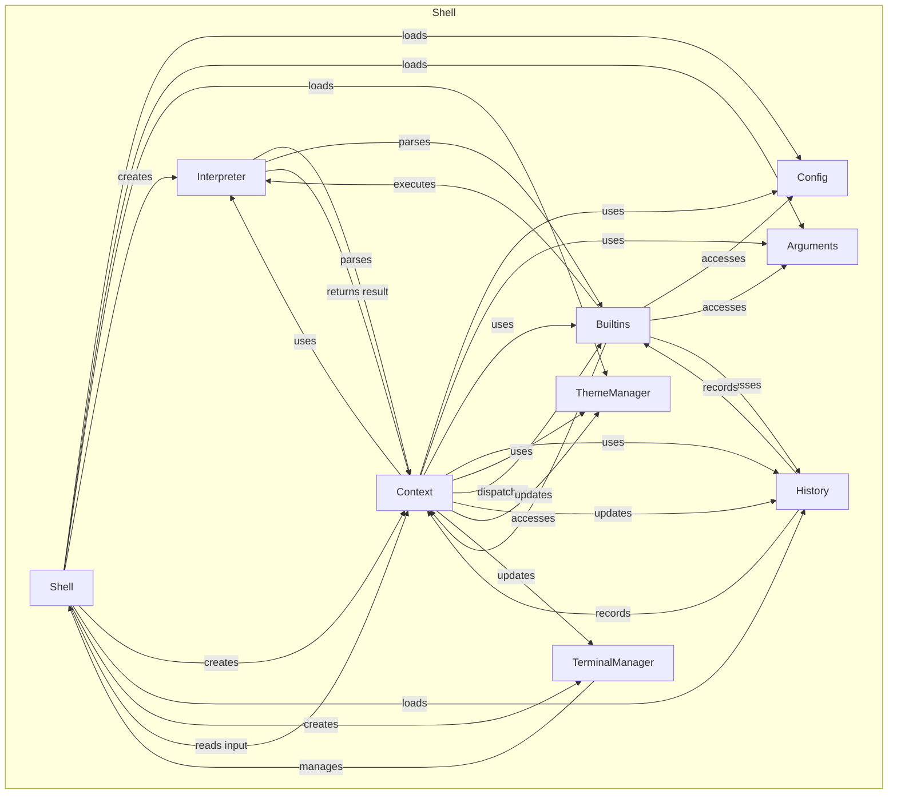

# Language Model Specification

This document outlines the architecture and interaction flow of the Turtle shell modules, detailing how they communicate and collaborate to provide a seamless user experience.

---

## **Turtle Shell Module Interaction Flow**

---

## **Explanation of Flow**

- **Shell** is the entry point, initializing all major modules.
- **Config** and **Arguments** provide configuration and runtime parameters.
- **ThemeManager** manages prompt and style.
- **Interpreter** parses and executes code, using context and builtins.
- **Context** is the execution environment, holding environment variables, aliases, history, and builtins.
- **Builtins** are shell commands/functions, accessing context, config, arguments, and history.
- **History** records command events and is updated after each command.
- **TerminalManager** manages terminal size and state, used by Shell and Context.
- **User input** flows from Shell to Context, which dispatches to Builtins, which may invoke Interpreter. Results are returned to Context, which updates History, ThemeManager, and TerminalManager as needed.

---

## **Summary Table**

| Module           | Interacts With                | Purpose                                 |
|------------------|------------------------------|-----------------------------------------|
| Shell            | Config, Arguments, Context    | Main loop, orchestrates everything      |
| Config           | Shell, Context, Builtins      | Stores configuration                    |
| Arguments        | Shell, Context, Builtins      | Stores CLI arguments                    |
| ThemeManager     | Shell, Context                | Manages prompt and style                |
| Interpreter      | Context, Builtins             | Parses and executes code                |
| Context          | Shell, Builtins, Interpreter  | Execution environment                   |
| Builtins         | Context, Config, Arguments    | Shell built-in commands                 |
| History          | Shell, Context, Builtins      | Records command history                 |
| TerminalManager  | Shell, Context                | Manages terminal state                  |

---

If you want a more detailed diagram (e.g., with async signals, channels, or specific function calls), let me know!