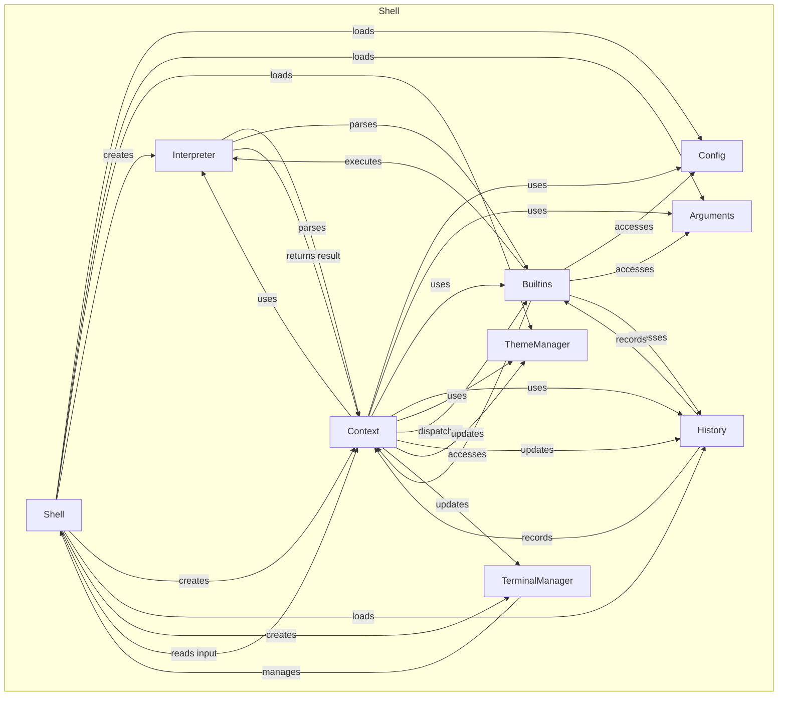

# Turtle Language Specification

Turtle is an interpreted language derived from rust and designed for automating tasks in a shell-like environment. It supports variables, functions, control flow, and built-in commands.

## Workflow



## Syntax

Turtle's syntax is inspired by `rust` and `python`, making it easy to learn for users familiar with those languages. Here are some of the key syntax elements:

- **Variables**: Variables are declared using the `let` and `set` keywords and can hold values of different types.
  - the `let` keyword declares a new turtle variable, once set, the turtle interpreter will substitute occurrences of the variable name with its value. Declared using `let VAR_NAME = VALUE`
  - the `set` keyword assigns a new environment variable, which can be accessed by subprocesses. Set using `set VAR_NAME = VALUE`
- **Data Types**: Turtle supports core data types
  - Number
    - Integer
    - Float
    - Complex
  - String
    - Raw String
    - Multiline String
    - Template String
  - Boolean
    - Null
    - True
    - False
  - Object
  - Array
  - File
  - Directory
  - HttpRequest
  - HttpResponse
  - Command
  - Process
  - System
  - DateTime
  - Regex
  - Tensor
  - MlModel
  - AiModel
  - NnLayer
- **Functions**: Functions are defined using the `fn` keyword and can take parameters and return values.

  - ```rust
    fn function_name(param1, param2) {
        // function body
        return value;
    }
    ```

- **Control Flow**: Turtle supports `if`, `else`, `while`, and `for` statements for controlling the flow of execution.
- **Built-in Commands**: Turtle includes a set of built-in commands for common tasks, such as `print`, `input`, and `len`.

## Example

Here is a hello world script in Turtle:

```rust
let message = "Hello, world!";
print(message);
```

This script declares three variables, adds them together, and prints the result.

## Built-in Functions

Turtle includes a number of built-in functions that can be used in scripts. Here are some of the most commonly used built-in functions:

- `print(value)`: Prints the specified value to the console.
- `input(prompt)`: Prompts the user for input and returns the entered value.
- `len(array)`: Returns the length of the specified array.

## Conclusion

Turtle is a powerful and easy-to-use scripting language that is well-suited for automating tasks in a shell-like environment. With its simple syntax and built-in functions, Turtle makes it easy to write scripts that can perform complex tasks with minimal effort.
